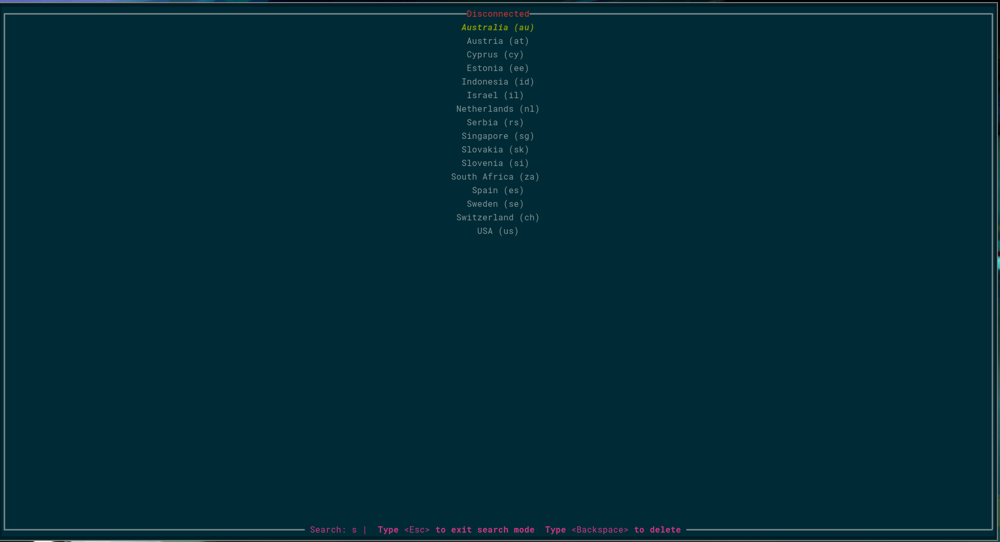

# mullvad-tui

### Disclaimer: This was just a quick hack that I made from [@Degra02's nordvpn-tui](https://github.com/Degra02/nordvpn-tui). All credit goes to him and maybe a tiny bit to the power of llm's (I barely know rust whatsoever)

`mullvad-tui` is a terminal-based user interface (TUI) tool built in Rust that provides a simple and interactive way to manage mullvad connections. The tool allows users to browse, search, and select countries and cities for VPN connection directly from the terminal using keyboard navigation.



## Features

- **Scrollable country and city list**: Navigate through a list of all available countries and cities using arrow keys.
- **Search functionality**: Quickly search for countries and cities.
- **Vim-like key bindings**: Supports familiar keybindings such as `gg` to jump to the top and `G` to jump to the bottom of lists.
- **Keyboard-driven**: Navigate and select VPN servers entirely with your keyboard.
- **Connect with ease**: Instantly connect to the selected server using mullvad's CLI.

## Installation

### Prerequisites

Before installing, make sure you have the following installed:

- [Rust](https://www.rust-lang.org/tools/install)
- [mullvad CLI](https://mullvad.com/download/linux/)

  Ensure you have access to the mullvad command-line tool by verifying it is installed and accessible from the terminal:

  ```bash
  mullvad --version
  ```

### Build from source

Clone the repository and build the project:

```bash
git clone https://github.com/Degra02/mullvad-tui.git
cd mullvad-tui
cargo build --release
```

To run the tool:

```bash
cargo run --release
```

or alternatively

```bash
./target/release/mullvad-tui
```

## Custom Configuration

The file `config.toml` contains the configuration for the tool. You can customize the following settings:

- `colors`: Customize the colors of the interface.

An example file is found in the repository as `config-example.toml` which you can copy to `$HOME/.config/mullvad-tui/config.toml` and modify as needed.

## Usage

Once you start `mullvad-tui`, you will be presented with a list of countries where mullvad servers are available. You can navigate and connect using keyboard commands.

### Keyboard Shortcuts

In normal mode (default):

| Key                 | Action                                       |
| ------------------- | -------------------------------------------- |
| `K` or `Arrow Up`   | Move selection up                            |
| `J` or `Arrow Down` | Move selection down                          |
| `Enter`             | Select a country/city and connect to the VPN |
| `D`                 | Disconnect from the VPN                      |
| `i` or `/`          | Enter Search mode                            |
| `g g`               | Jump to the top of the list                  |
| `G`                 | Jump to the bottom of the list               |
| `q`                 | Quit the application                         |

In search mode:

| Key         | Action                    |
| ----------- | ------------------------- |
| `<char>`    | Add char to search query  |
| `Enter`     | Search with current query |
| `Backspace` | Delete last query char    |

Once you've selected a country (or city if available), pressing `Enter` will automatically connect to the selected location using mullvad.

## Contributing

Feel free to submit issues or pull requests to contribute to the development of `mullvad-tui`. Contributions are welcome!

1. Fork the repository.
2. Create a new branch (`git checkout -b feature-branch`).
3. Make your changes.
4. Commit your changes (`git commit -m 'Add some feature'`).
5. Push to the branch (`git push origin feature-branch`).
6. Open a pull request.

## License

This project is licensed under the MIT License. See the [LICENSE](LICENSE) file for details.
